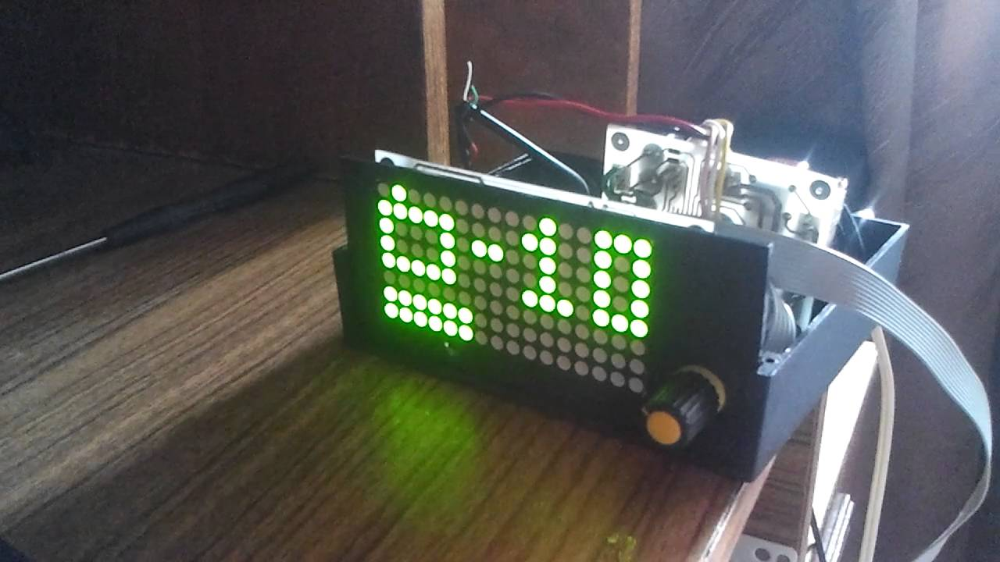

# VolMatrix

VolMatrix is a simple audio control module supporting various audio processors with I²C interface. It uses two 8x8 LED matrixes as a display. There is a current time displayed in standby mode. Any RC5/RC6/NEC/Samsung remote control can be used.

There is a [video](https://youtu.be/VJd88X46HLA) on Youtube about this.

# Main features:

* RC5/RC6/NEC/Samsung remote control support
* Remote control learning support
* DS1307-compatible RTC support

# Schematic

[Schematic](files/schematic.png)

# Remote control

To enter learn mode standby device and press 1 and 2 hardware buttons simultaneously for 2 seconds. You will see RC code and index number for first function - STANDBY. If you press button on remote control you'll see RC code changes. To save this code, press 3rd hardware button. Device will move to second, MUTE, function. After finishing learingn all functions press 1 and 2 buttons again to exit learn mode. Function index numbers are enumerated in <a href="src/display.h#L24-L33">sources</a>.

# Supported audio processors:

|Audioprocessor|Feature set                                                                    |
|--------------|-------------------------------------------------------------------------------|
|TDA7439       |4 stereo inputs, bass, middle, treble                                          |
|TDA7312       |4 stereo inputs, bass, treble                                                  |
|TDA7313/PT2313|3 stereo inputs, bass, treble, fade, loudness                                  |
|TDA7314       |Stereo input, bass, treble, fade, loudness                                     |
|TDA7315       |Stereo input, bass, treble                                                     |
|TDA7318       |4 stereo inputs, bass, treble, fade                                            |
|PT2314        |4 stereo inputs, bass, treble, loudness                                        |
|TDA7448       |6-ch input, fade, center, subwoofer                                            |
|PT2323/PT2322 |4 stereo inputs, 5.1 input, bass, treble, fade, center, subwoofer, surround, 3d|
|TEA6300       |3 stereo inputs, bass, treble, fade                                            |
|TEA6330       |Stereo input, bass, treble, fade                                               |

Required audioprocessor can be selected by editing [EEPROM file](eeprom/volmatrix.bin) and flashing it to the MCU. It's possible to edit the file manually using hex editor and the definitions from [eeprom.h](src/eeprom.h), [audio.h](src/audio/audio.h).

Alternatively, it's possible to use editor application from [ampcontrol](https://github.com/WiseLord/ampcontrol) project. The ampcontrol-m32 editor is address-compatible with this project. It's only required to cut resulting file to 512 bytes.

# Useful links:

* [Article about the project](http://radiokot.ru/konkursCatDay2015/10) (in Russian)
* [Forum thread](http://radiokot.ru/forum/viewtopic.php?t=121583) (in Russian)

